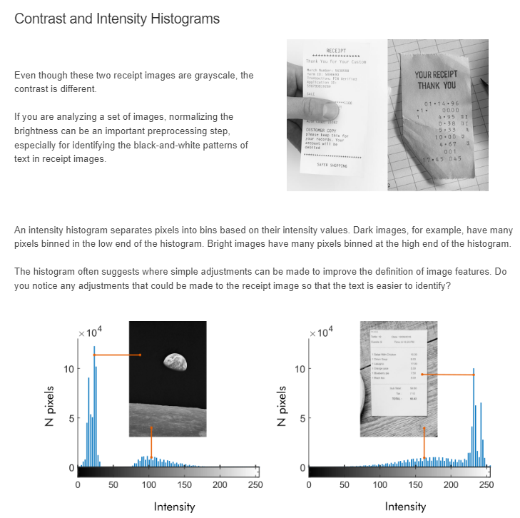
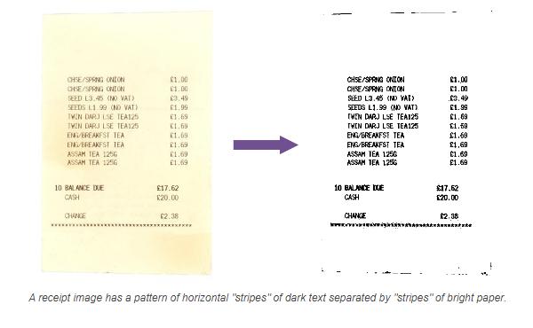

# Image Processing Onrmap
## Outline Identification
### Receipt Identification Workflow
1. Import
2. Preprocess
3. Segment
4. Postprocess
5. Classify
### Course Outline
- Working with Images in MATLAB
  - Import, display, and manipulate color and grayscale images.
- Segmentation an Image
  - Create binary images by thresholding pixel intensity values.
- Pre- and Postprocessing Techniques
  - Improve image segmentation by using common pre- and postprocessing techniques.
- Classification and Batch Processing
  - Develop a metric to classify image, and apply that metric to a set of image files.

### Lesson 1
- `imread(image_file_path:string);`
  - reads the image file
- `imshow(image:var);`
  - shows the image file
- `imshow(image:var, image:var,"montage");`
  - Shows the images side by side
- `imwrite(image:var, image_file_path_name:string);`
  - Saves an image variable to an image file
### Lesson 2
- `max(R,[],"all");`
  - Returns the max value of the R variable
  - Using the "all" option finds the maximum across all values in the array. The brackets are required; they are placeholders for an unused input.
- `min(R,[],"all");`
  - Returns the min value of the R variable
- `imsplit(I);`
  - Usage `[R,G,B] = imsplit(I);`
  - Can be used with montage by `montage({R,G,B});`
### Lesson 3

- `im2gray(I);`
  - Converts a colored image to grayscale  
- `imhist(I);`
  - Shows the intensity of the histogram
- `imadjust(gs2);`
  - Adjusts the contrast of a grayscale image automatically
- `imlocalbrighten(I);`
  - Adjusts the contrast of a colored image automatically
### Lesson 4
Image viewer app - is a point and click approach for displaying, view the information, and view and adjust the contrast of the image.
 
Can be open with `imtool`

#### Segmenting Text
The main feature of receipt images is dark text on a bright background. How can we leverage this feature?
 
One method is to separate the test from the background. Separating an image into distinct parts is called segmenting an image.
 

